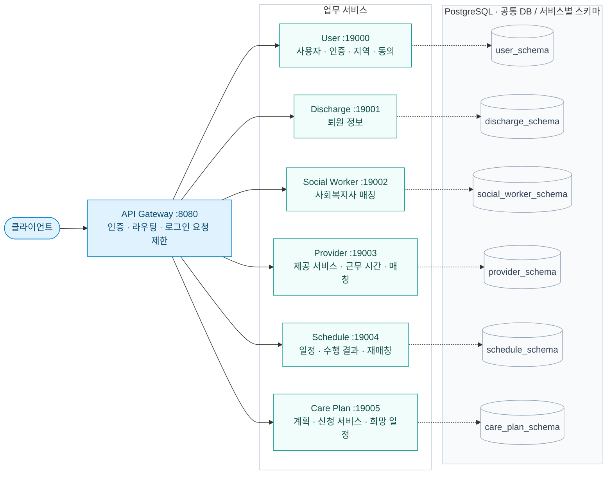
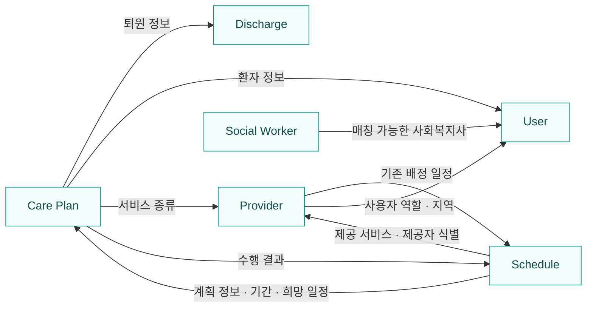
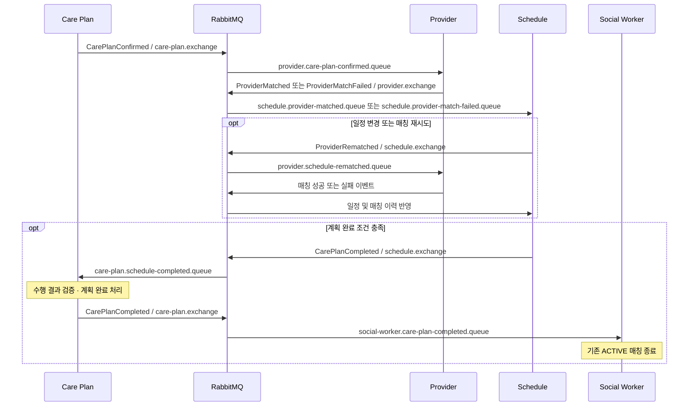
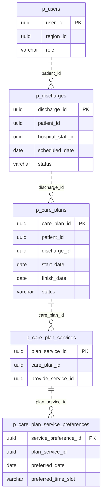
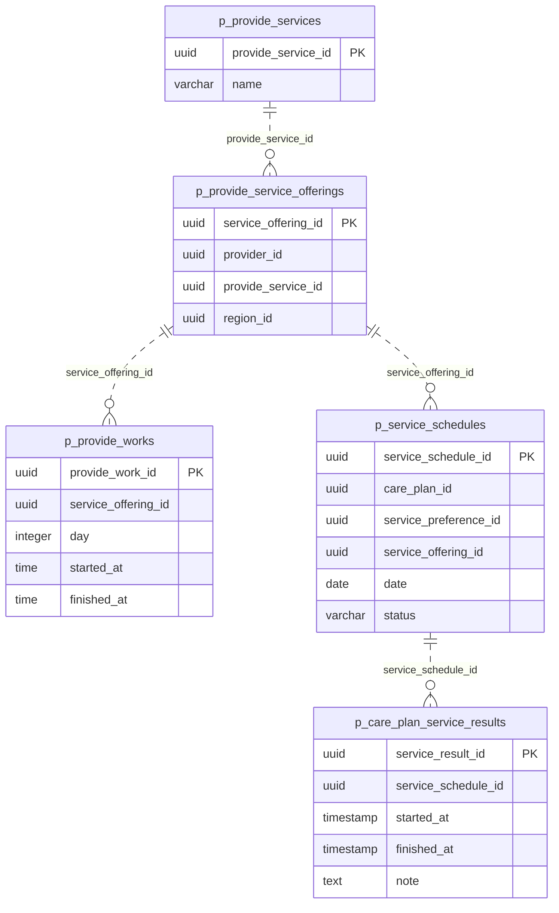
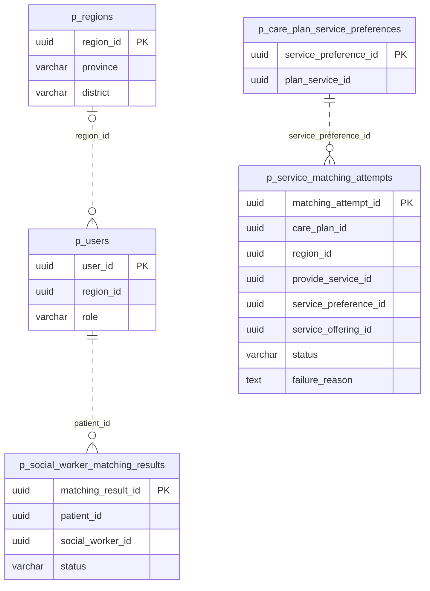

# 토닥토닥 · TodakTodag

> 퇴원은 치료의 끝이 아니라 **돌봄의 시작**이다.

병원이 퇴원 예정자에게 필요한 서비스를 제안하고, 퇴원 예정자가 자신의 Care Plan을 결정한 뒤 지역 내 서비스 제공자와 연결하여 퇴원 후 돌봄을 지속적으로 관리할 수 있도록 지원하는 **지역 기반 케어 플랫폼**입니다.

의료 인프라가 부족한 지역에서는 퇴원 이후 필요한 방문간호·방문요양·병원동행 같은 지역사회 서비스를 환자와 가족이 직접 찾아야 하고, 제공자마다 다른 일정을 일일이 조율해야 합니다.

토닥토닥은 이 과정을 하나의 흐름으로 잇습니다. 병원 직원이 퇴원 정보를 등록하면 환자는 Care Plan에서 필요한 서비스와 희망 날짜·시간대(오전/오후)를 선택합니다. 시스템은 **지역·서비스 종류·요일·시간**을 기준으로 제공자를 자동 배정하고, 이후 일정 변경·취소·재매칭·수행 결과 기록과 Care Plan 종결까지 관리합니다. 사회복지사 매칭을 통해 돌봄을 지원하는 기능도 제공합니다.

이 저장소는 토닥토닥의 **Spring 기반 MSA 백엔드**입니다. 아래 구성과 동작은 저장소의 코드 및 설정을 기준으로 설명합니다.

## 주요 기능

| 영역           | 제공 기능 |
|--------------| --- |
| 👤 사용자·인증    | 회원가입, 로그인, 사용자 승인·정보 관리, 지역 및 동의 문서 관리 |
| 🏥 퇴원 관리     | 퇴원 정보 등록·조회·수정, 퇴원 완료 처리 |
| 📋 Care Plan | 퇴원 정보에 연결된 계획 생성, 신청 서비스 및 희망 일정 관리, 계획 확정·상태 관리 |
| 🩺 서비스 제공자   | 제공 서비스 종류, 제공자의 서비스 등록 및 요일별 근무 시간 관리, 자동 매칭 |
| 🗓️ 일정·수행 결과 | 배정 일정 조회·변경·취소, 수행 완료 및 결과 등록, 매칭 실패 조회·재시도 |
| 🤝 사회복지사     | 비동기 매칭 요청, 작업 진행 상태 조회, 매칭 결과·상태 관리 |

## 서비스 이용 흐름

1. **퇴원 등록** — 병원 직원이 환자의 퇴원 정보를 등록합니다.
2. **Care Plan 구성** — 퇴원 정보를 바탕으로 계획을 만들고, 필요한 서비스와 희망 날짜·시간대를 등록합니다.
3. **계획 확정 및 자동 매칭** — 계획 확정 이벤트를 받아 지역과 서비스 조건에 맞는 제공자를 찾습니다.
4. **일정 생성** — 매칭 성공 시 일정을 생성하고, 실패 시 실패 이력을 남겨 재매칭할 수 있도록 합니다.
5. **서비스 이용 및 결과 기록** — 일정을 변경·취소하거나 수행을 완료하고 결과를 기록합니다.
6. **Care Plan 종결** — 일정과 수행 결과, 미해소 매칭 실패를 확인하여 완료 이벤트를 발행하고 계획을 종결합니다.

> **사회복지사 연결의 현재 구현:** 별도 매칭 요청 API로 연결을 시작합니다. Care Plan 완료 이벤트를 받으면 해당 환자의 기존 `ACTIVE` 매칭을 `ENDED`로 변경합니다. 따라서 “Care Plan 종결 후 사회복지사를 새로 자동 연결”하는 흐름과는 차이가 있습니다.

### 자동 매칭 기준

- 환자의 **지역**과 신청한 **서비스 종류**로 제공 서비스 후보를 조회합니다.
- 희망 날짜의 **요일**, 제공자의 **근무 시간**, 환자의 **희망 시간대**가 겹치는 구간을 찾습니다.
- 제공자 단위로 기존 일정과의 겹침을 확인합니다. 같은 제공자가 다른 서비스 종류로 맡은 일정도 고려합니다.
- 가능한 후보 중 조회된 점유 일정 수가 적은 제공자를 우선하며, 같으면 시작 시각이 빠른 후보를 선택합니다.
- 현재 서비스 소요 시간은 **1시간 고정**이며, 오전은 **09:00–13:00**, 오후는 **13:00–18:00**입니다.

## 시스템 구성

Gateway의 라우팅 설정, OpenFeign 클라이언트, RabbitMQ 바인딩, 서비스별 데이터 소스 설정을 기준으로 구성했습니다. 요청 경로·내부 조회·비동기 이벤트를 각각 나누어 표시합니다.

### 1. 외부 요청과 데이터 저장

실선은 HTTP 요청, 점선은 데이터 접근입니다. 아래 6개 스키마는 **동일한 PostgreSQL 데이터베이스 내부의 서비스별 영역**입니다.

Gateway는 명시된 경로를 Eureka의 서비스 이름으로 라우팅합니다. 클라이언트가 보낸 사용자 식별 헤더를 제거한 뒤, 인증된 요청에 사용자 ID·역할과 내부 JWT인 `X-Gateway-Token`을 설정합니다.

| 대상 서비스 | Gateway의 주요 라우팅 경로 |
| --- | --- |
| User | `/api/v1/users/**`, `/api/v1/auth/**`, `/api/v1/regions/**`, `/api/v1/consent-documents/**`, `/api/v1/consents/**` |
| Discharge | `/api/v1/discharges/**` |
| Social Worker | `/api/v1/social-worker-matchings/**` |
| Provider | `/api/v1/provide-services/**`, `/api/v1/service-offerings/**`, `/api/v1/provide-works/**` |
| Schedule | `/api/v1/service-schedules/**`, `/api/v1/service-results/**`, `/api/v1/matching-attempts/**` |
| Care Plan | `/api/v1/care-plans/**`, `/api/v1/care-plan-services/**`, `/api/v1/service-preferences/**` |

User·Provider·Care Plan의 관리용 경로와 각 서비스의 OpenAPI 문서 경로도 별도로 라우팅합니다.

### 2. 서비스 간 동기 조회

화살표는 **호출하는 서비스 → 조회를 제공하는 서비스**입니다. 다음 관계는 실제 OpenFeign 클라이언트에 선언된 내부 API이며 Gateway를 경유하지 않습니다.

내부 조회는 `/internal/v1/**` API와 `X-Internal-Api-Key`를 사용합니다. 예를 들어 Provider는 Schedule에서 기존 배정 일정을 조회해 매칭에 반영하고, Care Plan은 Schedule의 수행 결과를 조회해 완료 이벤트를 검증합니다.

### 3. RabbitMQ를 통한 비동기 연동

아래는 주요 이벤트 경로입니다. 완료·재매칭은 각각의 조건을 만족할 때 발생하며, 모든 메시지가 한 요청에서 연속으로 실행되는 것은 아닙니다.

동일한 `CarePlanCompleted` 이름을 쓰더라도 Schedule의 완료 통지와 Care Plan의 완료 확정은 **서로 다른 Exchange·Queue 경로**입니다. 발행은 Care Plan·Provider·Schedule의 Outbox 릴레이를 거칩니다.

### 4. 공통 플랫폼 · Redis · 관측 구성

업무 요청과 별도로 동작하는 공통 연결입니다. 모니터링 항목은 저장소의 수집·전송 설정을 나타내며 실제 수집 성공을 의미하지 않습니다.

| 구성 요소 | 실제 연결 및 역할 |
| --- | --- |
| Config Server · 8888 | native 저장소인 `config-repo`에서 설정을 읽어 Gateway·Eureka·6개 업무 서비스에 제공 |
| Eureka · 8761 | Gateway와 업무 서비스의 등록·탐색. Gateway의 `lb://` 라우팅과 Feign의 서비스 이름 기반 호출에 사용 |
| Redis · 6379 / Gateway | 접근 토큰 저장 정보 조회, Bucket4j 기반 로그인 요청 제한 |
| Redis · 6379 / User | 접근 토큰 및 사용자별 토큰 키 관리 |
| Redis · 6379 / Social Worker | 비동기 매칭 작업 상태 및 이벤트 중복 처리 방어용 정보 저장 |
| Prometheus | Gateway·6개 업무 서비스의 `/actuator/prometheus`를 수집하도록 설정 |
| Alloy → Loki | Docker 컨테이너 로그를 읽어 Loki로 전송 |
| 애플리케이션 → Zipkin | 분산 추적 데이터 전송 |
| Grafana | Prometheus·Loki·Zipkin을 데이터 소스로 조회, 로그의 traceId로 추적 연결 |
| Prometheus → Alertmanager | 알림 규칙 평가 결과 전달 |

구성도 확인에 사용한 코드·설정

- 외부 요청: `api-gateway/src/main/resources/application.yml`, `PhantomAuthenticationFilter`
- 내부 조회: Care Plan의 `DischargeFeignClient`, `UserFeignClient`, `ProviderServiceFeignClient`, `ScheduleFeignClient`; Provider의 `UserClient`, `ScheduleClient`; Schedule의 `CarePlanClient`, `ProviderServiceOfferingClient`; Social Worker의 `UserServiceClient`
- 이벤트 연결: 각 서비스의 `RabbitMqConfig`, 이벤트 Listener·Consumer 및 Outbox Relay
- 공통 설정·저장소: `config-repo/*-local.yml`, `config-server/src/main/resources/application-local.yml`
- Redis 사용: `AccessTokenStore`, `RateLimitConfig`, `AccessTokenStoreAdapter`, `RedisMatchingTaskStore`, `RedisEventIdempotencyStore`
- 관측 구성: `docker/prometheus/prometheus.yml`, `docker/alloy/config.alloy`, `docker/grafana/datasources.yml`

### 주요 이벤트 흐름

| 이벤트 | 발행 → 소비 | 처리 |
| --- | --- | --- |
| `CarePlanConfirmed` | Care Plan → Provider | 확정된 계획의 서비스 제공자 매칭 |
| `ProviderMatched` | Provider → Schedule | 매칭 결과를 반영한 일정 생성 |
| `ProviderMatchFailed` | Provider → Schedule | 매칭 실패 기록 |
| `ProviderRematched` | Schedule → Provider | 일정 변경·매칭 재시도에 따른 재매칭 |
| `CarePlanCompleted` | Schedule → Care Plan | 일정 종료와 결과를 검증하여 계획 완료 처리 |
| `CarePlanCompleted` | Care Plan → Social Worker | 기존 사회복지사 매칭 종료 |

Care Plan·Provider·Schedule에는 **Transactional Outbox** 저장 및 릴레이가 구현되어 있습니다. 업무 데이터와 발행할 이벤트를 DB에 함께 저장한 뒤 릴레이가 메시지를 발행합니다. 재시도·중복 처리 방어는 각 서비스의 구현에 따릅니다.

일반적인 계획 완료 판정에서는 예정·재조정 중인 일정, 결과가 누락된 완료·미방문 일정, 미해소 초기 매칭 실패가 남아 있는지 확인합니다. 장기간 해소되지 않은 매칭 실패를 정리하는 별도의 보정 스윕도 있습니다.

## 기술 스택

| 구분 | 기술 |
| --- | --- |
| 언어·빌드 | Java 21, 서비스별 Gradle Wrapper |
| 애플리케이션 | Spring Boot 4.1.1, Spring Cloud 2025.1.3 |
| API·데이터 접근 | Spring MVC, Spring Data JPA, QueryDSL, Bean Validation |
| 서비스 연동 | Spring Cloud Gateway(WebFlux), Eureka, Config, OpenFeign |
| 데이터 | PostgreSQL 17, Redis 7.4, Flyway |
| 메시징 | RabbitMQ, Spring AMQP |
| 인증 | Spring Security, JWT, 내부 JWT 및 JWKS |
| API 문서 | springdoc-openapi / Swagger UI |
| 테스트 | JUnit, Mockito, Spring Boot Test, Testcontainers |
| 실행·자동화 | Docker Compose, GitHub Actions |
| 관측 | Actuator, Micrometer, Prometheus, Grafana, Loki, Alloy, Zipkin, Alertmanager |

버전은 저장소의 `build.gradle`과 Compose 설정에 기재된 값입니다.

## ERD

실제 엔티티와 Flyway 마이그레이션을 바탕으로 핵심 업무 테이블을 세 영역으로 나누었습니다. 표기된 관계는 **ID를 통한 논리적 참조 관계**이며, DB의 물리적 외래 키 제약을 의미하지 않습니다. 공통 감사·삭제 컬럼과 인증·동의·Outbox 테이블은 가독성을 위해 생략했습니다.

### 1. 환자 · 퇴원 · 돌봄 계획

사용자·퇴원·Care Plan은 각각 별도 스키마에 저장됩니다. 퇴원의 병원 직원과 Care Plan의 환자도 사용자 ID를 참조합니다. 신청 서비스의 `provide_service_id`는 아래 서비스 종류 테이블을 가리킵니다.

### 2. 서비스 제공 · 일정 · 수행 결과

제공 서비스·근무 시간은 Provider, 일정·수행 결과는 Schedule 스키마가 관리합니다. 일정은 앞선 Care Plan 및 희망 일정 ID와 연결됩니다. 위 다중성은 저장 구조 기준이며, 수행 결과의 중복 등록 같은 업무 제약은 애플리케이션에서 별도로 처리합니다.

### 3. 지역 · 매칭 이력

사회복지사 매칭의 `social_worker_id` 역시 사용자를 참조하며, 배정 전에는 비어 있을 수 있습니다. 서비스 매칭 이력의 `service_offering_id`도 실패 시 비어 있을 수 있습니다. 지역은 사용자뿐 아니라 제공 서비스와 매칭 이력에서도 참조합니다.

## 프로젝트 구조

| 경로 | 구성 |
| --- | --- |
| `api-gateway`, `config-server`, `eureka-server` | 요청 진입점, 설정 관리, 서비스 탐색 |
| 6개 업무 서비스 디렉터리 | 도메인별 API·비즈니스 로직·데이터 관리 |
| `config-repo` | 공통 및 서비스별 local/prod 설정 |
| `docker` | 로컬·배포 Compose, 모니터링 설정 |
| `docs` | 프로젝트 기획 및 개발 문서 |
| `.github/workflows` | 서비스별 CI |

각 서비스는 독립적인 Gradle 프로젝트입니다. 업무 코드는 API를 담당하는 Presentation, 유스케이스를 조합하는 Application, 엔티티와 저장소 계약을 정의하는 Domain, 영속성과 외부 연동을 구현하는 Infrastructure 계층으로 구성합니다.

## 실행 및 검증

### 실행 준비

| 단계 | 내용 |
| --- | --- |
| 개발 환경 | JDK 21, Docker Compose 준비 |
| 환경 설정 | 루트 `.env.example`을 참고해 `.env` 구성. DB·RabbitMQ·Redis 접속 정보, 인증 키·쿠키 설정, 초기 마스터 계정 정보 보완 |
| 애플리케이션 빌드 | 서비스별 Gradle Wrapper의 `bootJar` 작업으로 실행 JAR 생성 |
| 인프라 실행 | `docker/compose-infra.yml`의 DB·메시징·Config·Eureka·Gateway 실행 |
| 업무 서비스 실행 | 인프라 health 상태 확인 후 `docker/compose-app.yml` 실행 |
| 모니터링 | 필요 시 Prometheus·Grafana·Loki·Alloy·Alertmanager 추가 실행 |

루트 환경 예제에는 일부 필수 변수가 빠져 있으므로 프로파일별 설정과 Compose의 환경 변수 목록을 함께 확인해야 합니다. 애플리케이션 Compose는 인프라가 생성한 `todak-network`를 사용합니다. DB 스키마는 Flyway로 관리하며 JPA가 검증합니다.

### 접속 주소

| 용도 | 주소 |
| --- | --- |
| API Gateway | <http://localhost:8080> |
| 통합 Swagger UI | <http://localhost:8080/swagger-ui.html> |
| Eureka | <http://localhost:8761> |
| RabbitMQ 관리 화면 | <http://localhost:15672> |
| Zipkin | <http://localhost:9411> |
| Prometheus / Grafana | <http://localhost:9090> / <http://localhost:3000> |

### 테스트 및 CI

매칭 규칙, API·권한 처리, 저장소, Outbox 발행, 완료 판정, 동시성 등을 대상으로 한 테스트가 포함되어 있습니다. 서비스별 Gradle의 `test` 작업으로 실행하며, Testcontainers 기반 통합 테스트에는 Docker 환경이 필요합니다. GitHub Actions에는 서비스별 변경 경로에 따라 동작하는 CI가 정의되어 있습니다.

이 README는 코드·설정·테스트 소스를 확인하여 작성했습니다. 전체 서비스 기동이나 테스트 실행 성공을 검증한 문서는 아닙니다.

## 관련 문서

- [프로젝트 기획안](docs/기획안.md)
- [프로파일별 서비스 설정](config-repo) · [실행·모니터링 구성](docker)

## 팀원 소개
| 김경민                     | 최한솔                     | 서주성                                    | 정수민                                | 김정석                                | 원제희                    |
|-------------------------|-------------------------|----------------------------------------|------------------------------------|------------------------------------|------------------------|
| 일정 도메인 운영   구조 전체 리드 | 케어플랜 구현   모니터링 정책 정비 | 인증 및 Auth 흐름 설계   API Gateway 진입 점검 | 서비스 관리 및 제공자 매칭   매칭 판정 알고리즘 설계 | 약관 및 지역 관리 API 구현   인프라 구축 및 배포 | 퇴원 상태 전이   사회복지사 매칭 |
